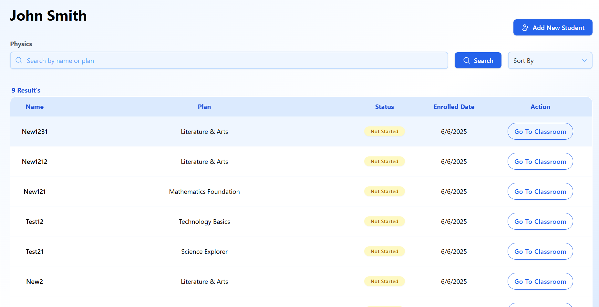
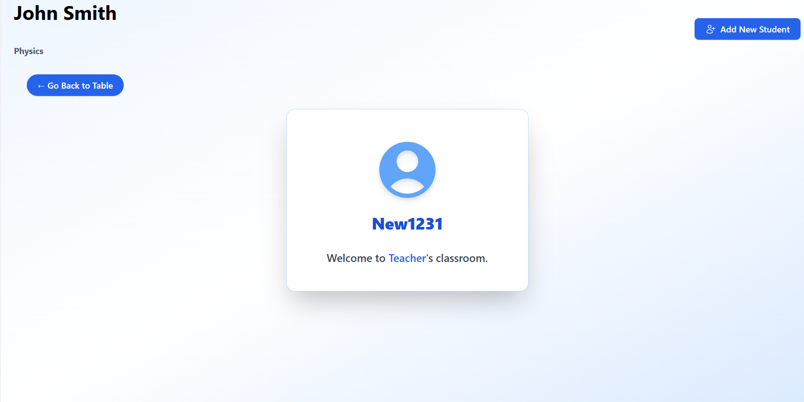
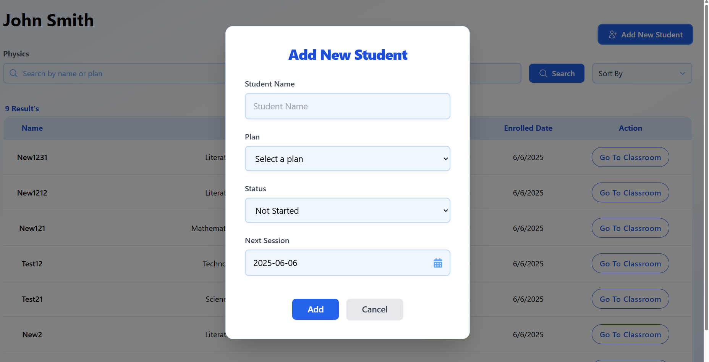

# Student Dashboard Task

This repository contains both the frontend (React + Vite) and backend (Django REST) for the Student Teacher Management project.

## Structure

- `frontend/` — Student Portal Dashboard
- `backend/` — Django REST API backend

---

## Backend (Django REST)

### How to Run

1. Install dependencies:
   ```sh
   pip install -r backend/requirements.txt
   ```
2. (Optional) Copy `.env` and set your secrets and DB config.
3. Run development server:
   ```sh
   python backend/manage.py runserver --settings=api.settings.dev
   ```
4. Visit `/api/docs/` for API docs, `/__debug__/` for debug toolbar.

### Linting & Formatting

- Run `flake8 .` for linting
- Run `black .` for formatting
- Run `isort .` for import sorting

### Testing

- Add tests in each app's `tests.py`
- Run tests with:
  ```sh
  python backend/manage.py test --settings=api.settings.dev
  ```

### Production

- Use `api/settings/prod.py` and set `DEBUG=False` and secure secrets.
- Set up static/media file handling as needed.

### API Documentation

- `/api/schema/` for OpenAPI schema
- `/api/docs/` for Swagger UI

---

## Frontend (React + Vite)

### How to Run

1. Install dependencies:
   ```sh
   cd frontend
   npm install
   ```
2. Start the development server:
   ```sh
   npm run dev
   ```
3. The app will be available at `http://localhost:5173` by default.

### Linting & Formatting

- Run `npm run lint` for linting (if configured)
- Run `npm run format` for formatting (if configured)

### Building for Production

1. Build the frontend:
   ```sh
   npm run build
   ```
2. The production-ready files will be in `frontend/dist/`.

### Notes
- The frontend expects the backend API to be running and accessible (see `.env` or Vite config for API URL).
- Update API endpoints in `frontend/src/utils/api.js` if needed.

---

## Screenshots

### Dashboard View


### Classroom View


### Add New Students



---

## Docker (Optional)

You can use Docker Compose to run both frontend and backend:

```sh
# From the project root
# Build and start all services
docker-compose up --build
```

---

## Contact
For any issues, please open an issue in this repository.
